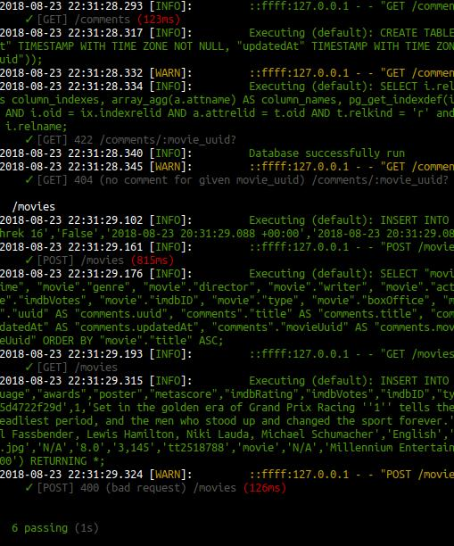

## Movie Rest Api with omdbapi.com and PostgreSQL

Project endpoints can be found on an app, which is deploy on heroku:

https://node-js-rest-api-movie.herokuapp.com/comments

https://node-js-rest-api-movie.herokuapp.com/movies

Feel free to try **GET, POST, DELETE, PUT**

#### Steps to follow if you want to launch application on your own:
**1.** Install *PostgreSQL*  
**2.** *Git clone* the project  
**3.** Install *node* and *npm*  
**4.** In the folder with the project run *npm i*  
**5.** Run *node server.js*  
**6.** To start tests run *npm test*  

Tests results:

Movies endpoint allows us to sort data by passing sort argument (title or date..), to filter movies:

https://node-js-rest-api-movie.herokuapp.com/movies?sort_column=title&sort_direction=ASC  
https://node-js-rest-api-movie.herokuapp.com/movies?sort_column=title&sort_direction=DESC

Aplication doesn't allow us to add the film, which is already exists in the database.

Comments endpoint allows us to view comments for the movie by passing its movie_uuid:

https://node-js-rest-api-movie.herokuapp.com/comments?movie_uuid=0cf23644-0e90-4a6f-b133-c2629a5fe613
